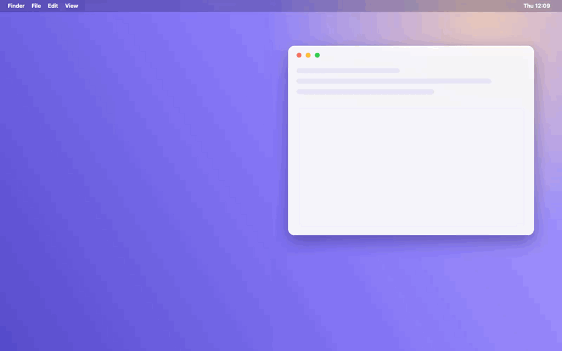
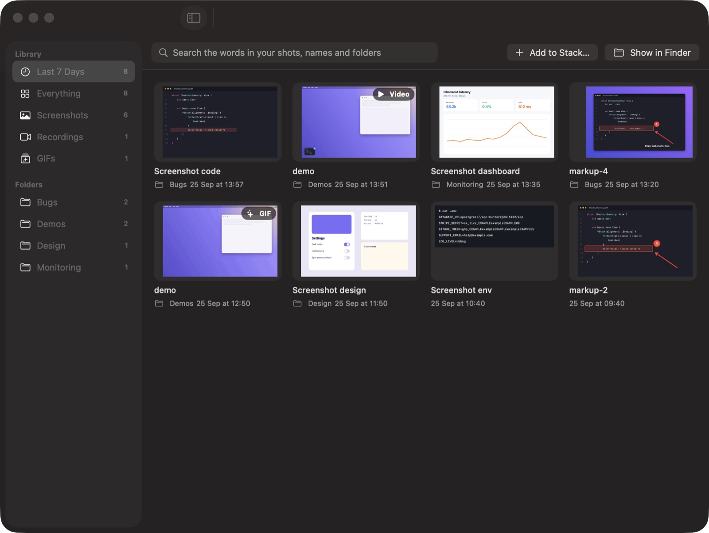

<p align="center">
  
</p>

<h1 align="center">Stackling</h1>

<p align="center"><strong>A little stack that keeps your screenshots.</strong></p>

<p align="center">A free, open-source app for Mac. Every screenshot and screen recording you take waits in a neat
stack in the corner of your screen until you're ready to use it.</p>

<p align="center"><a href="https://stackling.leonm.co.uk"><strong>stackling.leonm.co.uk</strong></a> ·
<a href="../../releases/latest/download/Stackling.zip"><strong>Download for Mac</strong></a></p>

<p align="center">
  
</p>

---

## Why you might like it

When you take a screenshot on a Mac, a thumbnail pops up for a few seconds and slides away, and the
file lands on your Desktop with everything else. Stackling keeps it within reach instead:

- **Screenshots wait for you.** They stack up in the bottom-left corner. Copy one, drag it into Slack or
  an email, or mark it up, whenever you're ready.
- **Better captures.** The screen freezes while you pick an area, so menus and hover effects stay put.
- **Mark up in seconds.** Arrows, boxes, text, numbered steps and highlights, plus a pretty background
  when you want to post it somewhere.
- **Hide secrets before you share.** One click blacks out passwords, API keys, emails and card numbers.
- **Screen recordings too,** with a one-click GIF for Slack or GitHub.
- **No more messy Desktop.** Shots go into a tidy folder and clean themselves up after a week.

It's small, it runs quietly in your menu bar, and nothing leaves your Mac unless you ask it to.

## Get it

1. Download **Stackling.zip** from the [latest release](../../releases/latest)
2. Unzip it and drag **Stackling** into your **Applications** folder
3. Open it

**"Stackling can't be opened because Apple cannot check it"?** That's macOS being careful with apps
that don't come from the App Store yet. To open it anyway:

1. Click **Done** on that message
2. Open **System Settings → Privacy & Security**
3. Scroll down and click **Open Anyway** next to Stackling, then confirm

You only have to do this once. The first time you take a screenshot, macOS also asks for
**Screen Recording** permission. Stackling needs that to freeze your screen. Turn it on, then reopen Stackling.

Requires macOS 14 (Sonoma) or newer. Works on Apple Silicon and Intel Macs.

## The basics

| Press | To |
| --- | --- |
| `⇧⌘4` | Capture an area. The screen freezes and a magnifier shows exact pixels |
| `⇧⌘8` | Capture a window: hover it and click |
| `⇧⌘9` | Capture the whole screen |
| `⇧⌘7` | Record your screen. Press it again to stop |
| `⇧⌘3` / `⇧⌘5` | The Mac's own tools still work, and their shots land in the stack too |
| Dock icon or `⌘L` | Open the library of everything you've captured |

Each new shot slides into the stack. **Hover a card** to see what you can do with it:

| Do this | What happens |
| --- | --- |
| **Copy** | Copies it, ready to paste anywhere |
| **Drag** it | Drops it into any app: Slack, Mail, Figma, Finder… |
| **Edit** (or click the picture) | Opens the editor to mark it up |
| **Text** | Copies the words in the screenshot |
| **📌** | Pins it on top of everything, handy for copying from one app into another |
| **✕** | Takes it off the stack. The file stays safe |

After a couple of quiet seconds the stack shrinks into a small box in its corner. Click it to open the
stack again. If it's ever in your way, drag it anywhere by the **✥** handle on a card.

**Not just new screenshots.** Anything can go in the stack and get the same treatment, like an image someone
sent you, an old screenshot, a video to turn into a GIF, or a picture you copied:

- Drop files on Stackling's **Dock icon**, or onto the stack itself
- In Finder, right-click a file → **Open With → Stackling**
- Menu bar icon → **Add to Stack…**, or **Paste to Stack** for whatever you've copied
- Just cleared the stack? Menu bar icon → **Bring Back Last Shot**

Files you bring in stay where they are.

<details>
<summary><strong>More: keyboard shortcuts on a card, the ⋯ menu, and moving the stack</strong></summary>

While your mouse is on a card: `⌘C` copies, `Space` or `E` opens it, `T` copies the text, `P` pins,
`G` copies a recording as a GIF, `Esc` dismisses and `⌘⌫` moves it to the Trash. These only work while
you're pointing at a card, so they never get in the way of your typing.

The **⋯** menu on a card has: File Into a folder, Name with Claude, Move to…, Show in Finder, Open in Preview,
Pin, Save Edits Into Image, Share and Copy File Path.

Drag the stack by its **✥** handle and it stays wherever you leave it. Drop it near the corner and it
snaps back, or click **↙**. Closed a card by accident? The menu bar icon has **Recently Dismissed**.
</details>

## The library

Click Stackling's **Dock icon** (or press `⌘L`) for the library: every screenshot, recording and GIF in one
place, grouped into Last 7 Days, Screenshots, Recordings, GIFs, your folders and the Archive.

- **Search reads the words inside your shots.** Type "cart.total" and last week's error screenshot turns up.
  Stackling reads each shot once, quietly in the background, on your Mac.
- **Double-click** to open, **drag** a shot into any app, **right-click** for everything else.
- **Select several** (`⌘`-click or `⇧`-click) to file them into a folder, add them to the stack, move them to
  the Trash, or ✨ **Tidy** just those with Claude.

<p align="center"></p>

## Marking up

Click a screenshot to open the editor. The tools each have a one-letter shortcut: **A**rrow,
**R**ectangle, **O**val, **L**ine, **P**en, **T**ext, **N**umbered steps, **H**ighlighter and
redact (**X**), which blurs out part of the picture.

- **✨ Beautify** puts your shot on a gradient background with rounded corners and a shadow.
- **🛡 Hide Secrets** finds passwords, API keys, tokens, emails and card numbers and covers them with solid
  blocks. It's quick, but give the result a glance before sharing: it can only hide what it can read.
- Your edits stay editable. Reopen a screenshot any time and move or delete anything. Copy and drag
  always include your edits.

## Screen recordings

Press `⇧⌘7`, then drag an area, click once for the whole screen, or press `Space` to pick a window.
A small bar shows the time with a **Stop** button. Press `⇧⌘7` again to finish.

Your recording lands in the stack. Click it to watch it, trim the start or end, or flip to the **GIF**
view to see exactly what you'd paste into Slack. No sound is recorded.

Want viewers to see the shortcuts you press? Turn on **Show shortcuts I press in recordings** in Settings.
Only shortcuts appear, like `⌘C` or `⎋`, never what you type.

## Keeping things tidy

Screenshots save to **Pictures › Stackling** instead of your Desktop.

- Loose screenshots get tidied into monthly **Archive** folders after 7 days. You can change that, or turn it off.
- **File Into** (in a card's **⋯** menu) puts a shot in a folder of its own. Those are never tidied away.
- Got a Desktop full of old screenshots? **Settings → Library → Move Desktop Screenshots Into the Library…**
  moves them in one go (it asks first, and only moves screenshots).

**✨ Tidy with Claude** is optional. If you use [Claude Code](https://claude.com/claude-code), Stackling can
ask it to look at your loose screenshots and recordings and suggest a clear name and a folder for each:

1. Click **✨ Tidy** on the stack (next to Clear all), or **Tidy with Claude…** in the menu bar
2. Check the list: change any name or folder, or untick anything you'd rather leave
3. Click **Apply**. Nothing moves before that

For one shot, choose **✨ Name with Claude** from its **⋯** menu. The ✨ buttons only appear once
Claude Code is installed.

```
Screenshot 2026-09-25 at 10.00.00.png  →  Bugs/checkout-summary-cart-items-undefined.png
```

You see every suggestion first and can change or skip any of them. Nothing moves until you click **Apply**.
It uses your own Claude account and only ever reads your screenshots.

### ⚡ Quick decisions with Jev (optional)

[Jev](https://typesafe.ai) is a small, very fast AI (answers in well under a second, for fractions of
a penny) that Stackling can ask for quick yes/no calls. Add a TypeSafe or OpenRouter key in
**Settings → Library → Jev**, then turn on whichever of these you want:

| Setting | What it does |
| --- | --- |
| **File new shots into the right folder** | Files each new shot into one of your folders when Jev is at least 60% sure. It goes by the words in the shot, the app and window it came from, and which shots already in your folders it looks like, so the more you file, the better it gets. Otherwise the shot stays put. |
| ↳ **Describe shots with no words** | For shots with next to no words, a small vision model describes the picture so Jev has something to go on. Needs an OpenRouter key. This is the only time a picture leaves your Mac, so it's off until you turn it on. |
| **Double-check Hide Secrets** | 🛡 Hide Secrets asks Jev whether each thing it found really looks like a secret, so fewer harmless words get blacked out. |
| **Spot junk when tidying** | ✨ Tidy marks shots that look like accidental or throwaway captures, with a tick box to send them to the Trash. |

Jev only ever gets **text**: the words Stackling read from a shot, the app and window title, and which of your
shots it resembles (worked out on your Mac with Apple's image matching). Never the picture. Secrets are masked before
they're sent (`sk_l… (32 characters: letters, digits)`). Your key is kept in the macOS Keychain.

## What works with what

| | Screenshots | Screen recordings | GIFs |
| --- | :---: | :---: | :---: |
| Copy, drag, file into a folder, Show in Finder | ✅ | ✅ | ✅ |
| Preview | Editor | ✅ plays on a loop | ✅ plays |
| Mark up, beautify, 🛡 Hide Secrets | ✅ | ❌ | ❌ |
| Copy the text in it | ✅ | ❌ | ❌ |
| Pin on top of everything | ✅ | ❌ | ❌ |
| Trim, copy or save as a GIF | | ✅ | |
| ✨ Tidy and Name with Claude | ✅ | ✅ from a frame of the video | ✅ |

Screenshots can be PNG, JPEG, HEIC, TIFF or PDF, whichever macOS is set to save. Stackling can't hide
secrets inside videos yet, so check a recording before you share it.

## Settings

Open **Settings** from the menu bar icon (or press `⌘,`). You can change how quickly the stack
shrinks, where screenshots are saved, how tidying works, whether new shots are copied automatically,
and whether Stackling handles `⇧⌘4` or leaves it to macOS.

## Your privacy

Stackling works entirely on your Mac. It doesn't have an account and doesn't send anything anywhere.
The exceptions are the optional AI features: **Tidy with Claude**, which only runs when you ask and uses
your own Claude Code, and **Jev**, which only runs if you add your own key and turn it on, and only sees text.

It asks for:

- **Screen Recording**, to freeze the screen and to record
- **Accessibility**, only if you turn on showing shortcuts in recordings

## What it changes on your Mac, and uninstalling

To avoid two previews, Stackling turns off the Mac's own floating screenshot thumbnail. It also takes over
`⇧⌘4` for its frozen-screen capture, and moves your screenshot folder from the Desktop to
Pictures › Stackling. It remembers how everything was before.

To remove it, choose **Stackling › Uninstall Stackling…** from the menu bar while Stackling is open.
That puts every one of those settings back, deletes the app and its settings, and leaves your
screenshots exactly where they are.

## Questions and ideas

Found a bug or have an idea? [Open an issue](../../issues). Stackling is a personal project, so there's
no promise of a quick reply, but everything gets read. Pull requests are welcome as suggestions. Changes
are reviewed and merged by the maintainer.

## For developers

Stackling is written in Swift (AppKit and SwiftUI) and builds with the Swift toolchain that comes
with Xcode.

```sh
git clone https://github.com/LeonMiltiadou/stackling.git
cd stackling
scripts/build.sh install   # build, copy to /Applications and open
swift test                 # run the tests
scripts/logs.sh 10m        # see what the app did in the last 10 minutes
```

[`AGENTS.md`](AGENTS.md) explains how the app is put together, its conventions and how to debug it.
It's written for AI coding assistants, and it's a good read for people too.

Stackling used to be called Stackshot. Updating from it carries your settings, library and edits across.

## Licence

[MIT](LICENSE). Use it, change it and share it, with credit.
